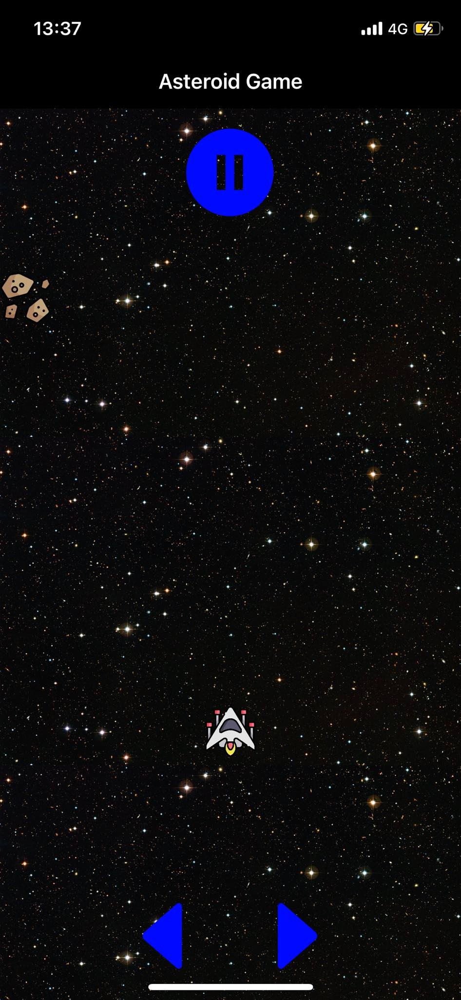
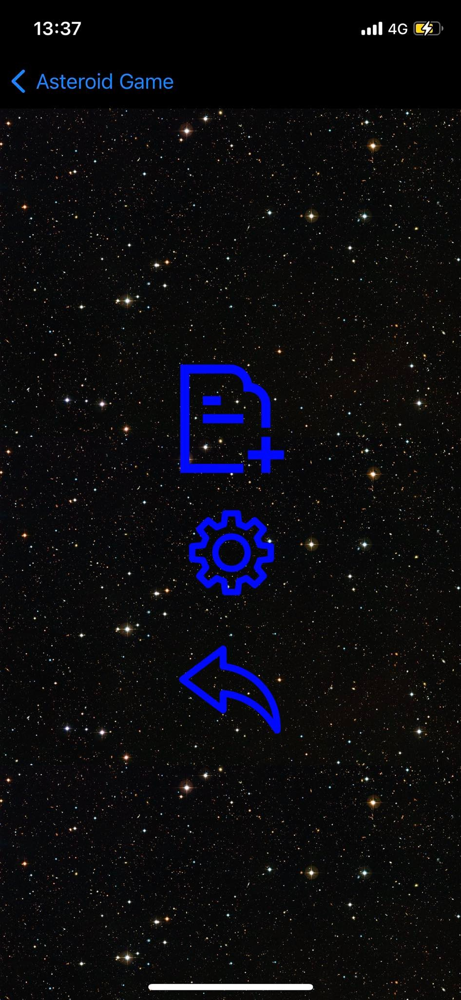
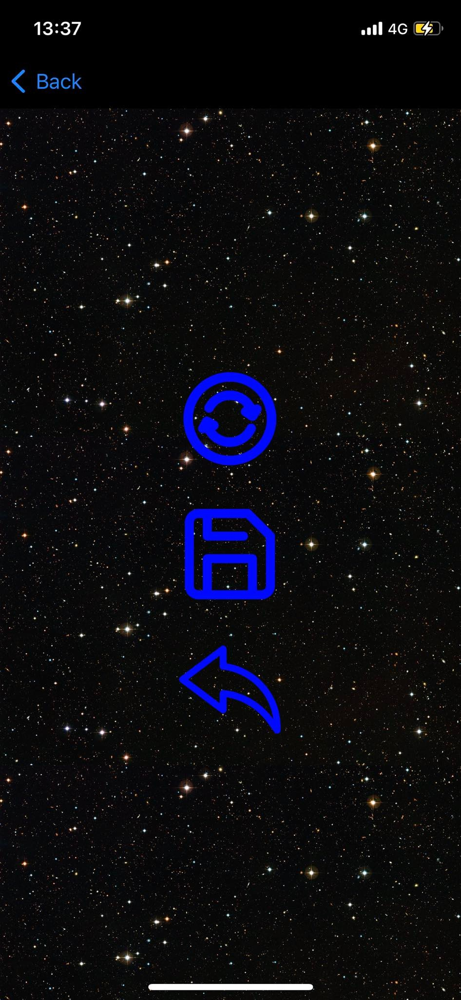
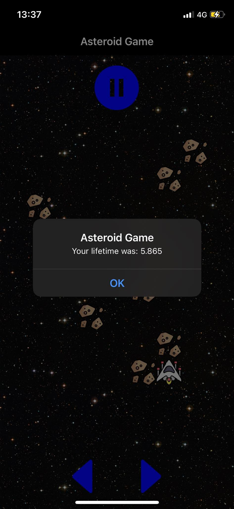

# Asteroid_Game
It's a personal project which is implemented in C# Xamarin. It uses MVVM architecture.
The game is very simple, you have to avoid the collasion with asteroids. You can save or load previous game if you want. 
## Screenshots
- In game   
- Menu    
- Save/Load menu   
- End game   
